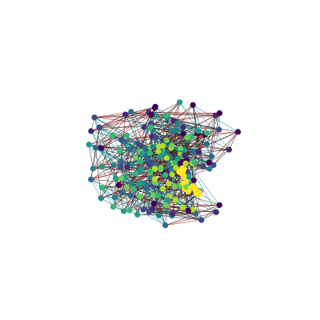
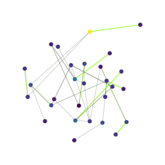
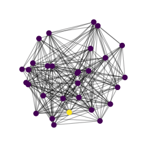

# netgross

[](https://circleci.com/gh/djanloo/netgross/tree/master)[](https://codecov.io/gh/djanloo/networkMDE)

This repository aims to implement some **network embedding algorithms** (MDE, t-SNE, UMAP) for dimensionality reduction and other networks-related stuff (processes over networks, maybe also _leaky integrate-and-fire_ for SNN in future).

## MDE strategy

Using a sum of squares loss over link distances the gradient is available in analytical form (no time wasted in computing it numerically).

The net is "inflated" using a repulsion strategy weighted with the inverse of the distance squared over random selected couples (pushing nodes away costs a lot of time apparently). This "squashes" the net and avoids overlapping manifold regions in the projection.

Then the net is evolved elastically using a "pull the childs" strategy for each node.

Everything done is opinable (I merely followed intuition and some suggestions from the MDE article) and suggestions are widely accepted.

## Further development
Most of the code is written in python3 but I had to resort to **extend with C** for the most resource-expensive tasks, even if I'm considering using cython.

The conceptual points of greater interest for me are:

- (possibly) **multiprocessing**
- (even more possibly) **GPU processing**
- find a more efficient way to **display** the data



 


## Installation
I suggest using a virtual environment running
```
pipenv install
pipenv shell
pip install .
```
in the main directory.

To install globally:
```
pip install .
```

